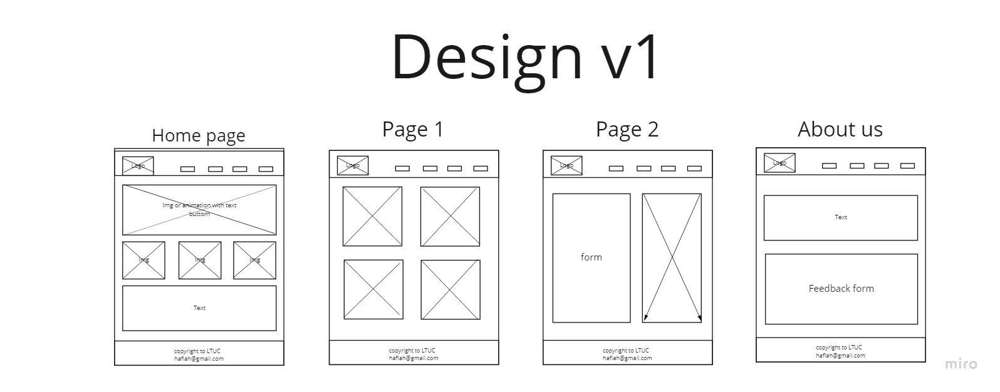
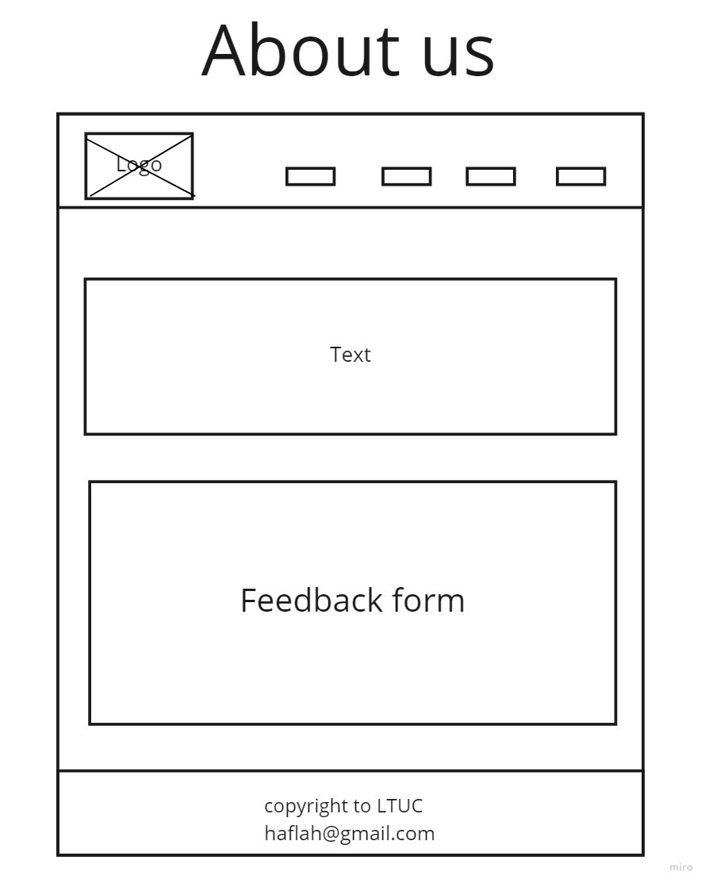
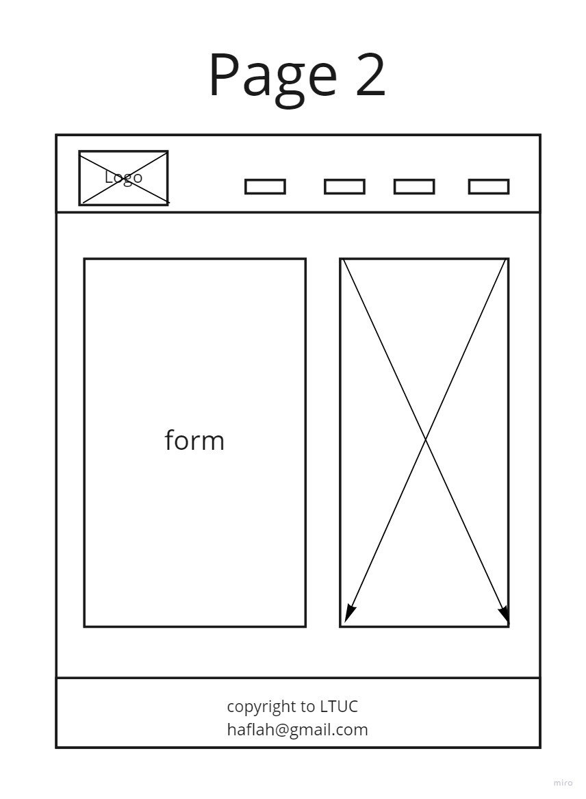
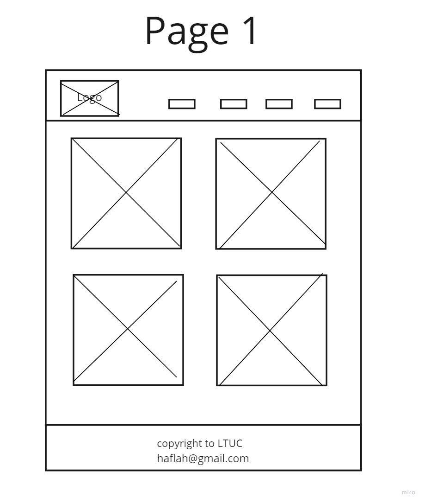
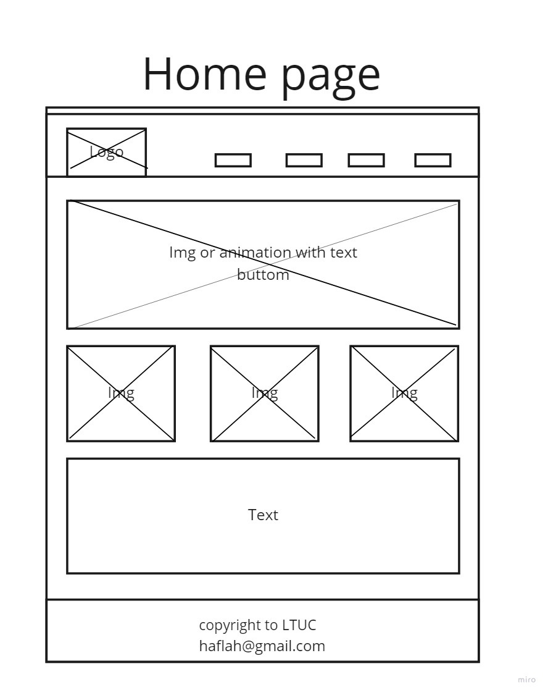

# party-event

## team members

- ## Deyaa pozan
- ## Mahmoud abu baker 
- ## Alanood alhedban
- ## Ghaida ghraibeh

***The website idea is for organizing parties such as weddings,
graduations and birthdays The user booking the place,
determines the location, time and number of attendance,
in addition to additional services .***

# Problem Domain :

**People face difficulty to find places for their party's ,so we are a Bit 404 team created a website helping people to choose beautiful place for party fulfill their requests**

**Our project will be based on placing booking System , we have different places with full description contain the name of place, location,and the price .when user decided which place preferred , filling the form then submitted to connect with user later.**

# wirefarme:
  

 

 

 

 

 # Resources :

 https://sweetalert2.github.io/#download

 https://miro.com/app/board/o9J_l_h018s=/

 https://www.logaster.com/logo/

  https://fonts.google.com/

  https://www.canva.com/colors/color-palette-generator/

 https://freefrontend.com/css-forms/

https://unsplash.com/

https://prezi.com/

https://fontawesome.com/
